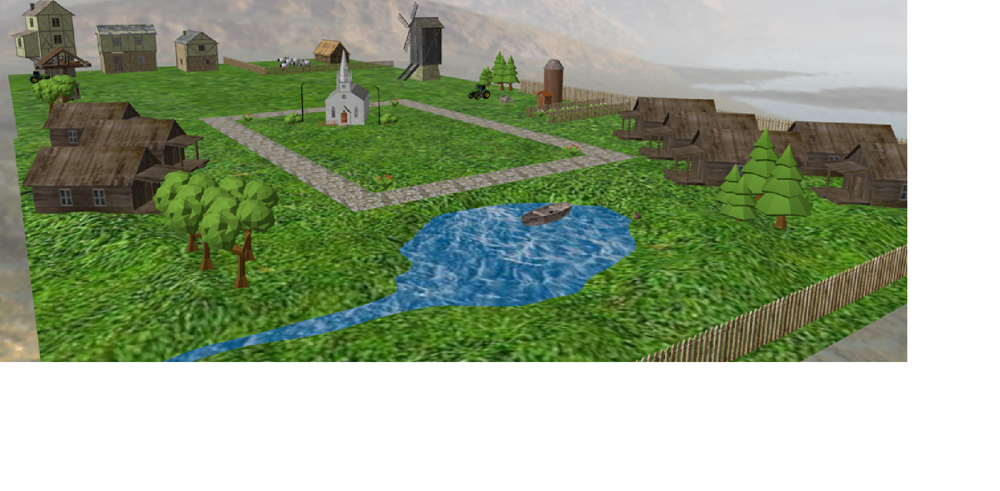

# **🏡 3D Village Scene – Blender & OpenGL**  

## **📌 Overview**  
This project showcases a **3D village scene**, modeled in **Blender** and rendered using **OpenGL**. The scene includes various 3D objects, realistic lighting, textures, and interactive camera controls to create a **dynamic and visually immersive environment**.  

## **🌄 Scene Description**  

### **Scene and Objects**  
The scene represents the **peaceful life of a countryside village**, evoking childhood nostalgia and a world free of worries.  

 **At the center of the village stands a church**, surrounded by a **rocky road** that connects all the main areas.  
 **Traditional wooden houses** are scattered around, alongside **a barn and a stable**, adding to the rustic charm.  
 **A small lake** lies at the edge of the scene, where a **boat gently moves** across the water.  
 The environment is enriched with **trees, flowers, farm animals in an enclosure, and a windmill** that rotates in the wind.  

This village scene captures the **essence of rural life**, blending natural elements with interactive features to create an engaging experience.  

## **Functionalities & Controls**  
The scene includes **multiple interactive features**, allowing users to explore and manipulate the environment:  

  **Camera Controls**  
- `W, A, S, D` – Move the camera around the scene.  
- `V` – Activates **automatic camera movement** through the scene.  

  **Day & Night Cycle**  
- `L` – Switch to **day mode**.  
- `N` – Switch to **night mode**.  

  **Weather Effects**  
- `P` – Toggle **rain effect** on/off.  
- `F` – Toggle **fog effect** on/off.  

  **Rendering Modes**  
- `1` – **Solid mode**.  
- `2` – **Wireframe mode**.  
- `3` – **Polygonal mode**.  
- `4` – **Smooth shading mode**.  

  **Lighting Controls**  
- `H` – Activate **directional light (sunlight)**.  
- `J` – Activate **spotlights (church lanterns)**.  
- `K` – Activate **point lights (house illumination at night)**.  

  **Windmill Animation**  
- `M` – Toggle **windmill rotation** on/off.  

## **🛠 Technologies Used**  
- **Blender** – For 3D modeling and texturing.  
- **OpenGL** – For rendering and real-time interaction.  
- **C++** – For scene control and functionality (if applicable).  
 
